# 🔴課題２　OSのインストール

## 条件
- VirtualBoxやWSLを利用してインストールしてください
- 公式ドキュメントに手順がない場合も多いので、そのときは他のサイトを参考にしてOKです

## まとめ

### 🟡virtualBoxをインストール
参考サイト 
[VirtualBoxをインストール1](https://www.sejuku.net/blog/75279) 
[VirtualBoxをインストール2](https://www.heiyoshilog-business.com/centos-install/)

1. インストール 
ローカルマシンがmacのIntelであったため、画像のものをインストール
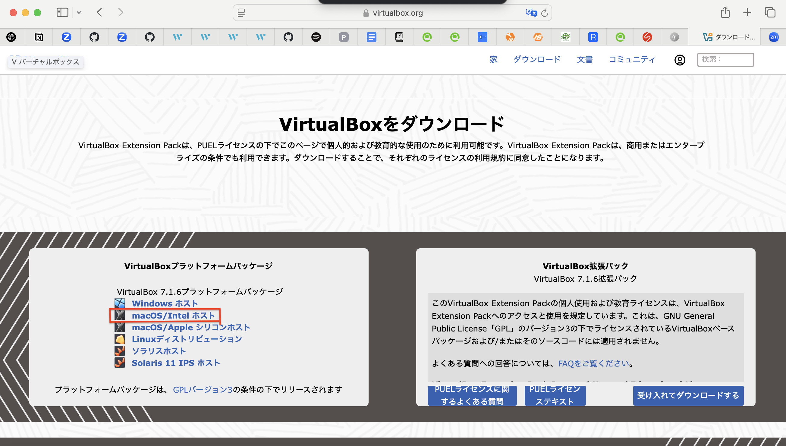

- ベーシック/エキスパートモードのどちらかを選択 
[参考サイト](https://gihyo.jp/admin/serial/01/ubuntu-recipe/0832)
を参考に、今回はベーシックモードを選択。
 
 

### 🟡centOSをインストール
[CentOS公式サイト](http://ftp.jaist.ac.jp/pub/Linux/CentOS/)から下記画像のcentOSをインストール
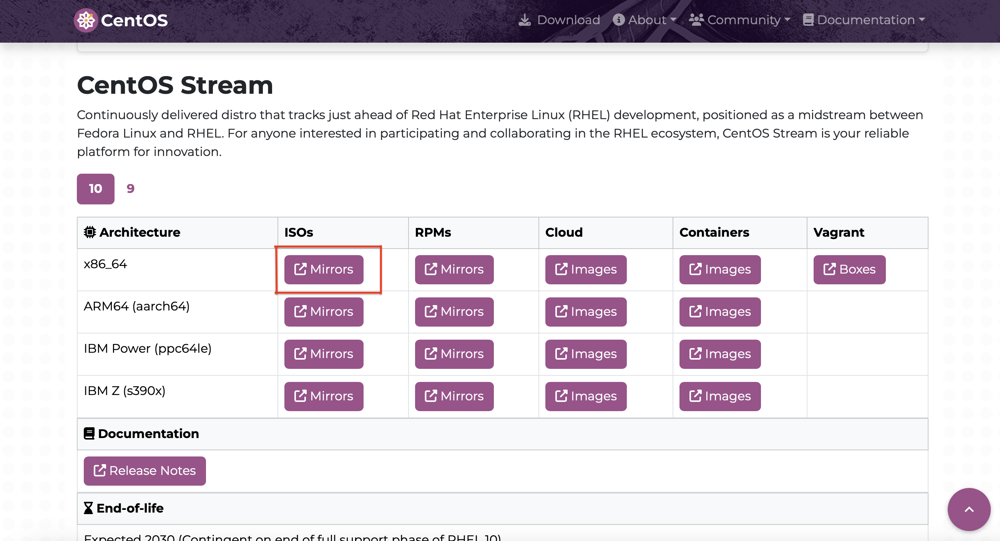
 
 

### 🟡virtualBoxで仮想マシンを作成

仮想マシン内容 
- 名前：centOS test
- フォルダー：/Users/user/VirtualBox VMs
- タイプ：Linux Subtype：Red Hat
- バージョン：Red Hat(64-bit)

- RAM(メモリ)の容量：1024MB
- HDDの容量：10.00GB  
完了

作成した仮想マシン”centOS test”のストレージ→ストレージデバイス→光学ドライブの追加より、 
先ほどインストールをした”CentOS-Stream-10-latest-x86_64-dvd1.iso”を追加し、マシンを起動。

※”CentOS-Stream-10-latest-x86_64-dvd1.iso”はダウンロード内にある。 
インストールしてもisoファイルはダブルクリックでは起動できない。ファイルをマウント？する必要があるので、
直接virtualBoxにOSとして追加。
 
 

### 🟡virtuarBoxを起動
起動して触ろうとすると画像のように注意書きが表示される。意味を
[VirtualBoxでの注意文](https://anything.hatenadiary.com/entry/2017/08/13/150456)
を参考
 
>「ここでは画面キャプチャのキャプチャではなく、使用権というか、操作権というか…を、仮想マシン側が握るかホストOS(つまりローカル端末)が握るかが変わりますよという意味ですね。 
 
> 仮想マシンのウィンドウ内にマウスをクリックするか、あるいは現在ホストキーに割り当てられている左⌘キーを押すと、マウスとキーボードの操作は仮想マシンウィンドウ上での操作として扱われ、ホストマシン(つまりローカル端末)の操作にマウスとキーボードを使うことができなくなるよ。 
 
> でも、ホストキーである左⌘を押せばいつでもマウスとキーボードはホストマシンのものに戻るぜ。とな。 
で、今マウスとキーボードは仮想マシンとホストマシンのどっち側なの？という情報は、
アイコンとその左隣にあるマウスの絵を見れば分かるようになってるよ。だそうです。」

とのこと。

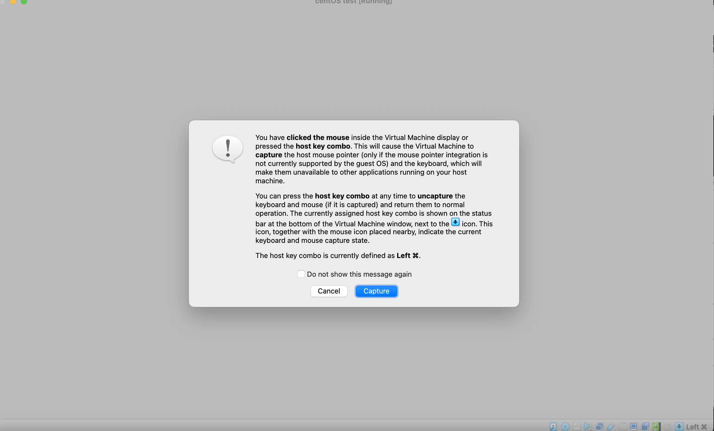
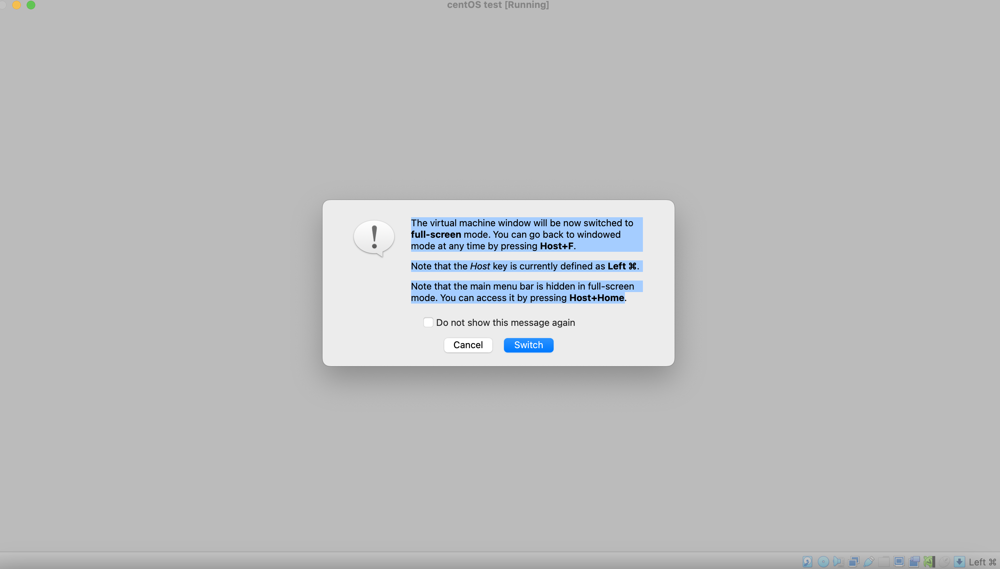
 

🟩コマンド
- ローカルマシンと仮想マシンのボタンを切り替えるホストキー
ホストキー：左⌘（commandボタン）

- フルスクリーンから通常のモードに戻す
ホストキー+F

- Host キーは現在、左 ⌘ として定義されていることに注意。

- フルスクリーン モードではメイン メニュー バーが非表示になっていることに注意。
Host+Home を押すとアクセスできる。
 
 

### 🟡centOSをvirtualBox内でインストール

1. 画面にInstall centOS 10のように出てきたので、矢印キーで一番上に移動、エンターキーを押してインストール開始。

インストールしてもグレーの画面になりcentOSがインストールされている気配なし。
[カーネルパニック](https://qiita.com/fuzzzi_iam/items/519a430491cbdf3498f4)
のサイトに書かれているカーネルパニックの解決方法を試す。

- 修正  
メインメモリー  
1024MB　→ 2048MB

再度起動してcentOSをインストールしたところ、”CENTOS STREAM 10 へようこそ”と共にインストール時に使用する言語を選択してくださいと表示された。
 

2. 日本語を選択→続行を押下
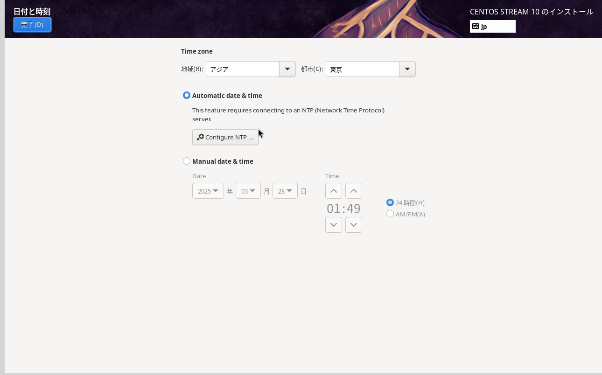
 
 

### 🟡インストールのための５つの設定

①ソフトウェアの選択 
サーバー（GUI使用）」を選択。 
これを選択することでインストール完了後に、GUI画面でもLinuxを操作することができる。
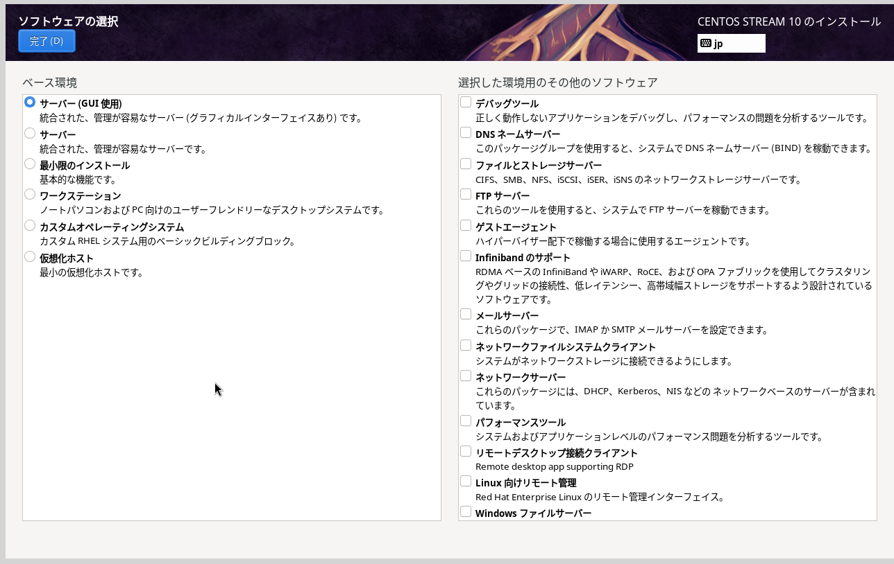
 
 

②インストール先  
ハードディスクが選択されていることを確認  
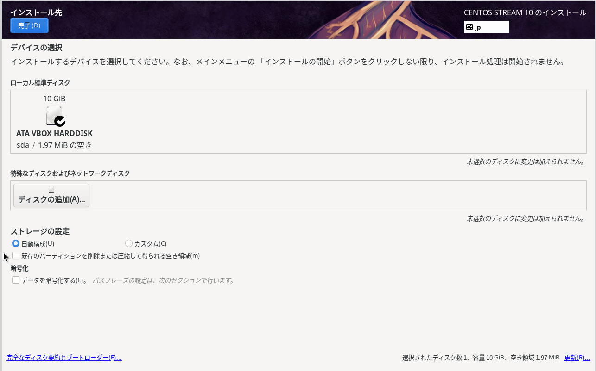
 
 

③ネットワークとホスト名
Ehternetをオンにする
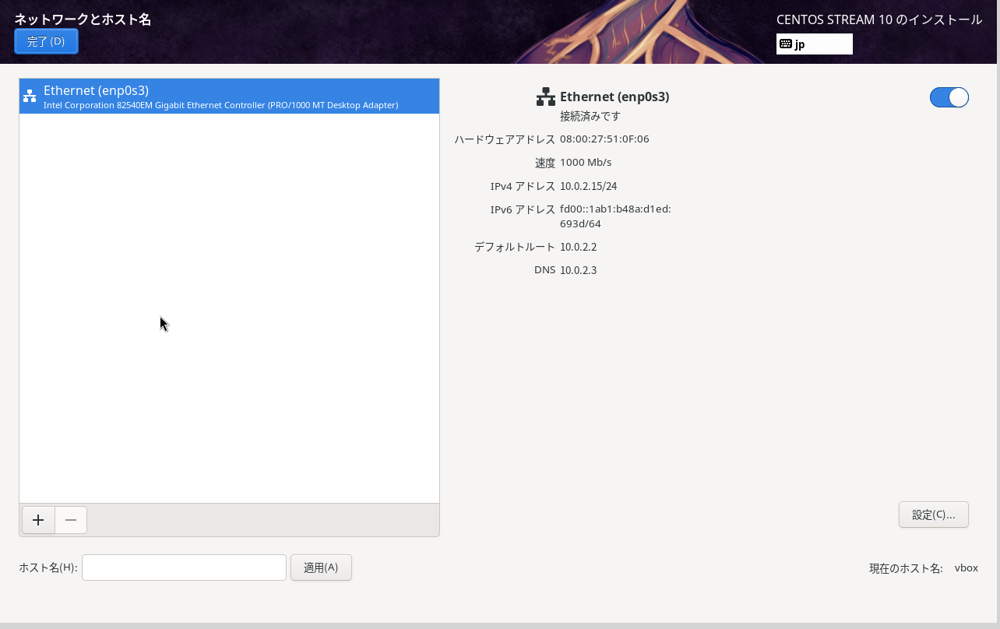
 
 

④Rootアカウント
rootパスワードを設定
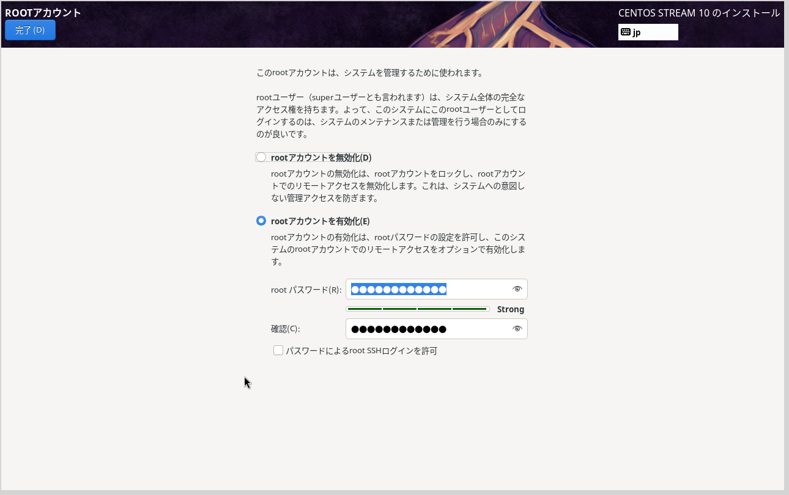
 
 

⑤ユーザーの作成
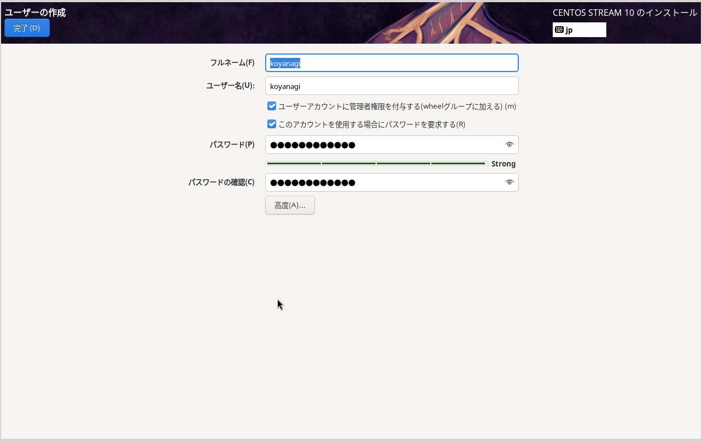
 
 

①〜⑤を設定したら、”インストール開始”を選択

インストール後、「再起動」を行えば、Linuxに先ほど作成したユーザーでサインインできるようになる。
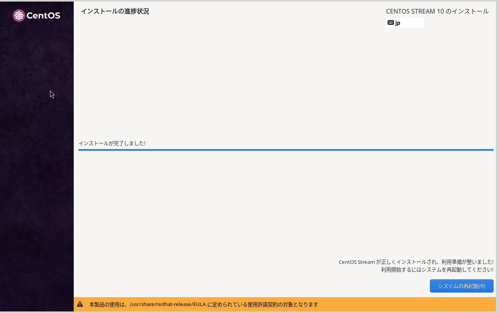
 
 

“システムの再起動”を押下後、Linuxに先ほど作成したユーザーサインインできるようになる。
パスワードなどを入力すると、サインインができた。 
課題３へ。
 
 

## 🔵次回試してみたいこと

- OSのバージョンを変更したら最新バージョンで取り組んだ今回とはどのような違いが起こるのかを試してみたい。

- 今回はVirtualBoxを使用したが、次回はWSLやAWS EC2など、他の環境でもOSインストールを試し、ツールや手順の違い、仮想環境ごとの制約を比較してみたい。
