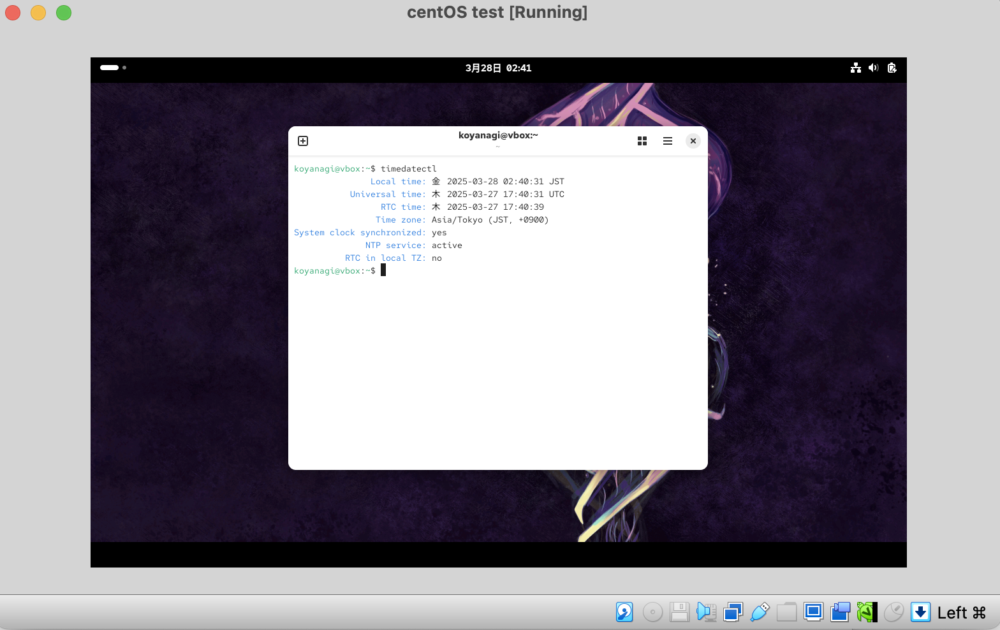
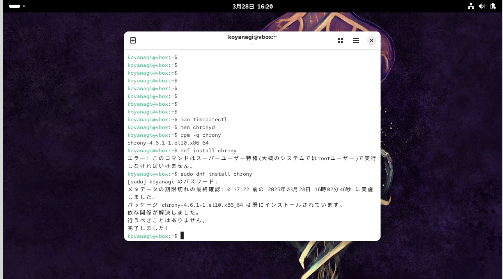
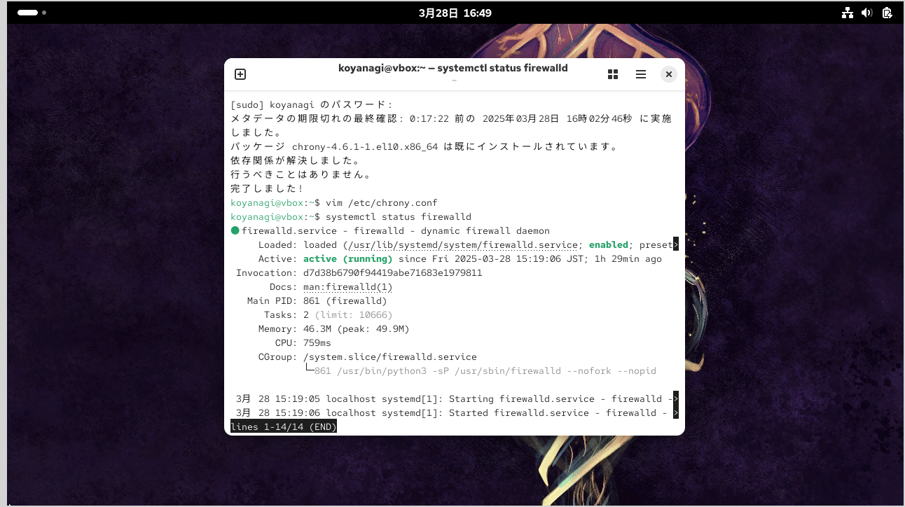
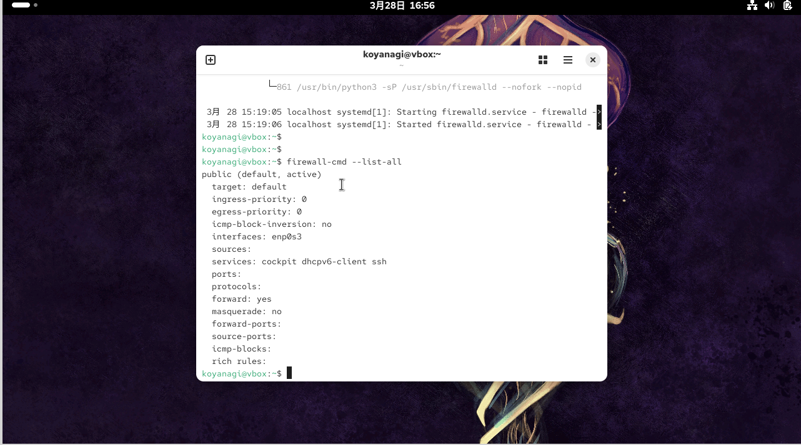
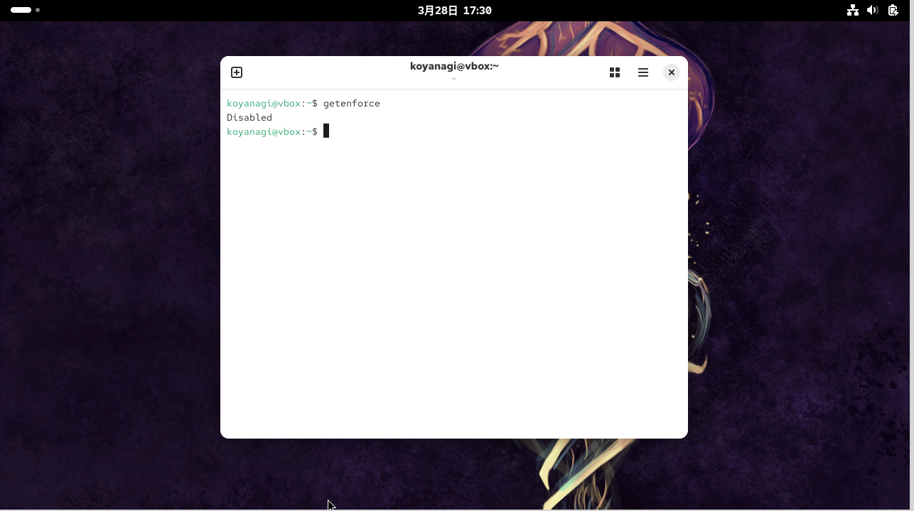

# 🔴課題3　OSインストール後

## 条件
OSをインストールしサーバにログインできたらまず下記を行ってください

- サーバのタイムゾーンをJSTにする
- すでにJSTであれば飛ばしてください

🟩ヒント
- `man timedatectl`
- 下記NTPサーバと時刻同期を行う
- ntp1.jst.mfeed.ad.jp
- ntp2.jst.mfeed.ad.jp
- ntp3.jst.mfeed.ad.jp
🟩ヒント
- https://chrony.tuxfamily.org/
- `man chronyd`, `man chronyc`
<br>
<br>
- サーバのファイアウォールを有効(起動)にしてください
- firewalld, ufwなど
- https://firewalld.org/
- `man firewall-cmd`
- `man ufw`
<br>
<br>
- SELinuxを無効にしてください
<br>
<br>

## まとめ

### 🟡タイムゾーン確認

サーバのタイムゾーンはすでにJSTになっていることを確認。


<br>
<br>

### 🟡画面サイズを変える
Guest Additionsをインストールすると、画面のサイズが変更できるとのこと。下記のサイトを参考に変更を実施<br>
- [VirtualBoxで画面解像度を変更する方法：完全ガイド](https://nakaterux.hatenablog.com/entry/2025/01/13/042126)<br>
- [VirtualBox Guest Additionsのインストール方法と機能について紹介！](https://www.sejuku.net/blog/76014)
<br>

#### 手順

1. VBoxGuestAdditions.isoを追加<br>
<br>
virtualBoxの上部メニューバー”Devices”→Insert Guest Additions CD images…を押すとインストールされる。<br>
確認方法：VirtualBoxのストレージ欄”デバイス”→”VBoxGuestAdditions.iso”が追加されていればOK
<br>
<br>

2. VirtualBoxのスケーリングモード・リサイズ機能を利用<br>
<br>
①仮想マシンの設定を変更<br>
VirtualBoxのメイン画面で仮想マシンを選択し、[設定] → [ディスプレイ] を開きます。<br>
スクリーンタブで「ビデオメモリ」を増加させる（128MB以上を推奨）。→128MBに変更。<br>
仮想マシンを起動し、仮想OS内で解像度を調整します。<br>
    * Linux: 設定メニュー → ディスプレイ → 解像度（Resolutions）を選択。<br>
    * ⚠️解像度デカすぎるとポインタが消えたり動きが遅くなったりするので、解像度の塩梅大事！！<br>

解像度低い方がポインタも見えるし、よく動かせる。一旦見辛いけど解像度低めで行っていくことにする。
<br>
<br>

②VirtualBoxのスケーリングモードを利用する<br>
1.仮想マシンを起動。<br>
2.VirtualBoxのメニューから、[表示] → [スケーリングモード] を選択。<br>
<br>
ホストキー＋C　でスケールスライダーを調整して、画面全体が見やすくなるようにします。
<br>
<br>

③自動リサイズ機能を使用する
Guest Additionsをインストールした後、自動的に画面サイズをリサイズする機能を利用できます。<br>

1.仮想マシンを起動します。<br>
2.VirtualBoxのメニューから、[表示] → [仮想画面1] → [自動サイズ調整] を有効にします。<br>
3.仮想マシンのウィンドウサイズを変更すると、解像度も自動で調整されます。
<br>
<br>

3. フルスクリーンモードでの使用
仮想マシンをフルスクリーンで使用する場合、以下の方法で解像度を調整できます：<br>
1.VirtualBoxメニューから、[表示] → [フルスクリーンモード] を選択。　ホストキー＋F<br>
2.仮想OS内で解像度を調整して、画面全体にフィットさせます。
<br>

やってみたけどポインタの感度が非常に悪くなったので元のサイズで課題を進める。
<br>
<br>

### 🟡仮想サーバーでの時間の設定(手順などを調べてみた)

コマンド一覧<br>
- man = manual　　man ~（調べたいもの）で調べることができる。<br>
- Eastern Standard Time = 東部標準時
<br>
<br>
- ntp1.jst.mfeed.ad.jp<br>
- ntp2.jst.mfeed.ad.jp<br>
- ntp3.jst.mfeed.ad.jp<br>
= ３つとも時刻合わせに利用が可能なNTPサーバ。お手持ちのパソコンや機器などのNTPによる時刻合わせ先として利用。
<br>

- chrony = ネットワークタイムプロトコル（NTP）の多目的な実装。<br>
✅chronyには2つのプログラムが含まれている<br>
①chronyd = 起動時に起動できるデーモン<br>
②chronyc = コマンドラインインターフェイスプログラムで、chronydのパフォーマンスを監視し、実行中にさまざまな動作パラメータを変更するために使用できる。<br>

時間の設定には、chronyが必要とのことなので、インストール実行。

#### 🟩chronyをインストール

- chronyとは・・・
Linux環境で利用される時刻同期を行うためのアプリケーション。
Network Time Protocol(NTP)を使用して、コンピュータの時刻を正確に保つことができる。

[参考サイト](
https://docs.redhat.com/ja/documentation/red_hat_enterprise_linux/9/html/configuring_basic_system_settings/using-chrony_configuring-time-synchronization#managing-chrony_using-chrony)

#chronyをインストール<br>
```
$dnf install chrony
```

実行したら、すでにインストール済み。


時間の設定は、[時刻同期chronyの導入のQuiita記事](https://qiita.com/mattsun/items/f2dc3519e1a628f81923) を参考

#/etc/chrony.confを編集 <br>
```
$ vim /etc/chrony.conf
```

⚠️今回はすでにJSTが最初に設定されているので、編集はしない。
<br>
<br>

### 🟡サーバのファイアウォールを有効(起動)する

[firewalld公式サイト](https://firewalld.org)　を見てみると、CentOS 7以降には、firewalldはデフォルトのファイアウォール管理ツールとして使用されている。<br>

ufwはUbuntsに搭載されているファイアウォールツールとのことなので今回は使用しない。

<br>

- firewalld（ファイアウォールディーモン）<br>
= Linuxディストリビューションで利用できるファイアウォールサービス。<br>
外部からのアクセスや攻撃を防ぐために、ネットワーク上のトラフィックを監視して許可されたトラフィックのみをシステムにアクセスできるように制御。
<br>

- firewalldのコマンド　　使い方：systemctl ⚪︎⚪︎ firewalld<br>

  - start ： firewalldを起動
  - stop ： firewalldを停止
  - status ： firewalldの状態を表示　
  - enable ： firewalldをサーバー起動時に自動で動作するようにする
  - disable ： firewalldをサーバー起動時に自動で動作しないようにする
  <br>
  <br>
  [参考サイト](https://linuc.org/study/column/5301/#:~:text=バックナンバー-,firewalldとは,サービスとして実行します%E3%80%82)を見ながら、firewalldが起動しているかを確認

#firewalldが起動しているかを確認<br>
```
$ systemctl status firewalld
```

動作していることが確認できた。


<br>

#### 🟩firewalldの操作
firewalldの操作はfirewall-cmdコマンドを使用。

#現在の設定状態を確認
```
$ firewall-cmd --list-all
```

<br>

確認するのは以下の３つ<br>
<br>
①public (active)<br>
publicとはゾーンと呼ばれるものの名前。<br>
外側に接続されているネットワーク領域というような感じ。状態がpublic(default,active)なので有効になっている。<br>

②target: default<br>
targetは、このゾーンに入ってきたパケットをどのように扱うかを設定している。<br>
defaultの場合、ICMPは通すが、それ以外は通さない設定となる。<br>
ICMPはpingコマンドなどで使われるプロトコル。pingコマンドに対して応答はする、ということになる。<br>

③services: cockpit dhcpv6-client dns ssh<br>
servicesは、パケットの通過を許可するサービス。<br>
具体的にはポート番号ということになるが、FTPのような一部のプロトコルについては接続形態などを考慮して設定が必要になる。<br>
servicesの設定で許可されていないプロトコル（ポート番号）への通信は、targetの設定に従って拒否される、という動作になる。
<br>
<br>

### 🟡SElinuxを無効にする

・SElinuxって何？<br>
ウイルス対策ソフトウェア、セキュアなパスワード、ファイアウォール、その他のセキュリティーシステムに代わるものではなく、既存のセキュリティーソリューションを強化することを目的としたもの。
<br>


⭕️[SElinuxの利点](https://docs.redhat.com/ja/documentation/red_hat_enterprise_linux/9/html/using_selinux/benefits-of-selinux_getting-started-with-selinux#benefits-of-selinux_getting-started-with-selinux)
<br>

- 開発・テスト環境での利便性
SELinuxは強力なセキュリティ機能を提供するが、正しく設定されていない場合、予期しないアクセス制御エラーを引き起こすことがある。特に、ウェブサーバーやデータベースの設定などで、SELinuxによってアクセスが制限されることが多い。<br>
開発やテスト環境で、SELinuxを無効化することで、こうした制限を回避し、すぐに作業を進めやすくすることができる。<br>
<br>

- 無効にする注意点
SELinux を無効にすると、システムが SELinux ポリシーをロードしなくなる。<br>
その結果、システムは SELinux ポリシーを適用せず、Access Vector Cache (AVC) メッセージをログに記録しない。したがって、SELinux を実行する利点 はすべて失われる。<br>
パフォーマンスが重視されるシステムなど、セキュリティーを弱めても重大なリスクが生じない特殊な状況を除き、SELinux を無効にしないこと。
<br>
<br>

#### 🟩SElinuxを無効化していく手順

[SElinuxを無効化](https://docs.redhat.com/ja/documentation/red_hat_enterprise_linux/9/html/using_selinux/enabling_and_disabling_selinux-disabling_selinux_changing-selinux-states-and-modes#Enabling_and_Disabling_SELinux-Disabling_SELinux_changing-selinux-states-and-modes)　の手順通りに進めて、SElinuxの無効化に成功
<br>

🟢前提<br>
#grubby パッケージがインストールされていることを確認
```
$ rpm -q grubby
```
→grubby-8.40-77.el10.x86_64　と表示あり。
<br>

🟢手順<br>

①ブートローダーを設定して、カーネルコマンドラインに selinux=0 を追加。<br>
```
$ sudo grubby --update-kernel ALL --args selinux=0
```
<br>
・grubby コマンド<br>
ブートローダーの設定を変更するためのコマンド。<br>
KVMなどの仮想化されたVPSで仮想のベースOSからコンソールログインしたり、OS起動時や停止時の起動ログを有効にしたりする際に使用。<br>
<br>

・KVM<br>
カーネルベースの仮想マシン（Kernel-based Virtual Machine）。<br>
Linuxカーネルに統合されており、Linuxを導入するとすぐに利用できる。<br>
<br>
・VPS
VPS（仮想専用サーバー）。物理サーバーを仮想化して複数のユーザーで共有するサーバーサービス。
<br>
<br>
②システムを再起動<br>
```
$ reboot
```

<br>

🟢検証<br>
再起動したら、getenforce コマンドが Disabled を返すことを確認。<br>
```
$ getenforce
Disabled
```
↓結果　Disabledを返している<br>
課題４へ

<br>
<br>

## 🔵次回試してみたいこと

- SELinuxを無効化して作業を行ったが、SELinuxを有効化したまま操作を続けると、どのような不具合や制限が出るのかを実験してみたい。

  - getenforce コマンドで「Enforcing」状態にして進めると途中で障害が起こるのか？