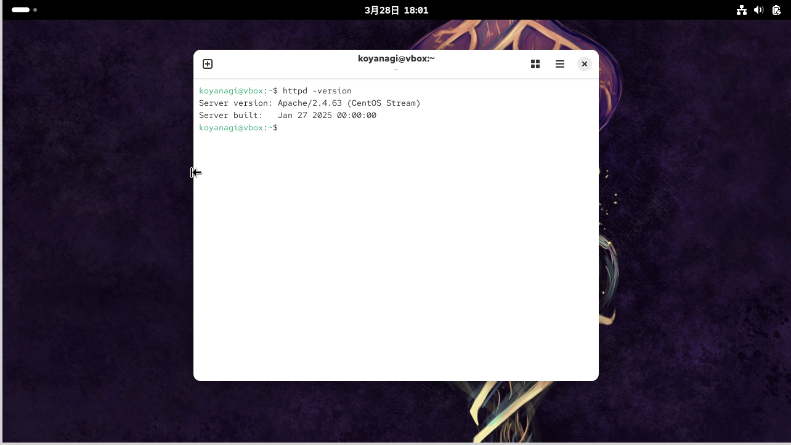
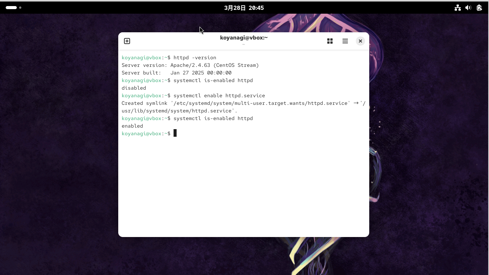
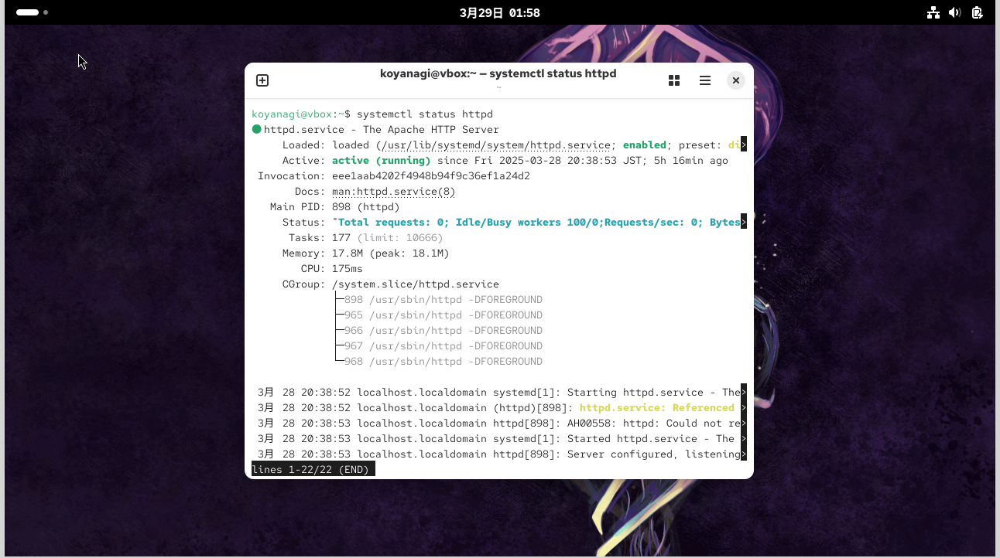
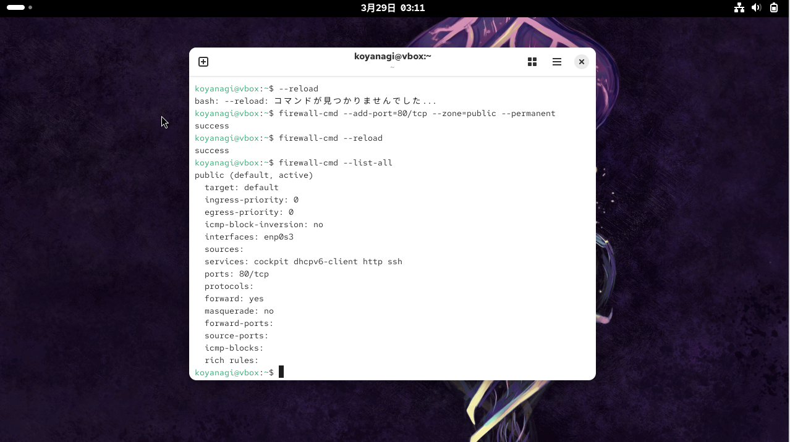
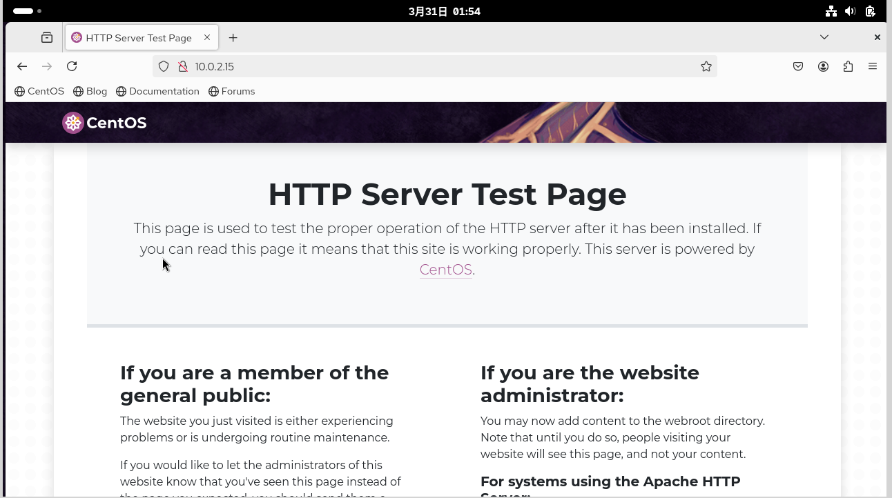
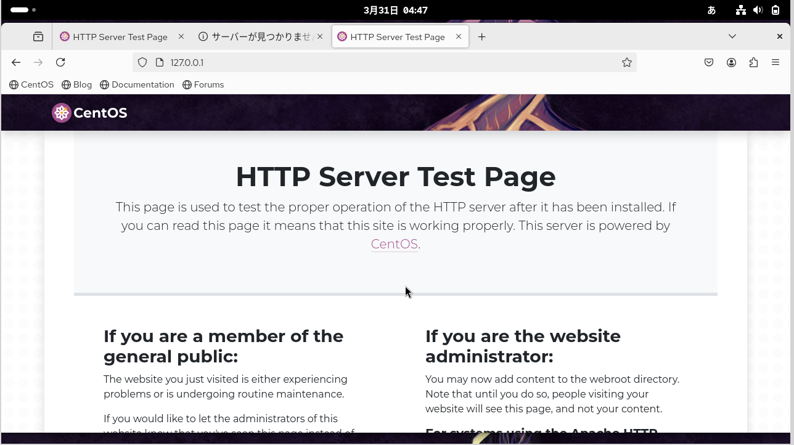
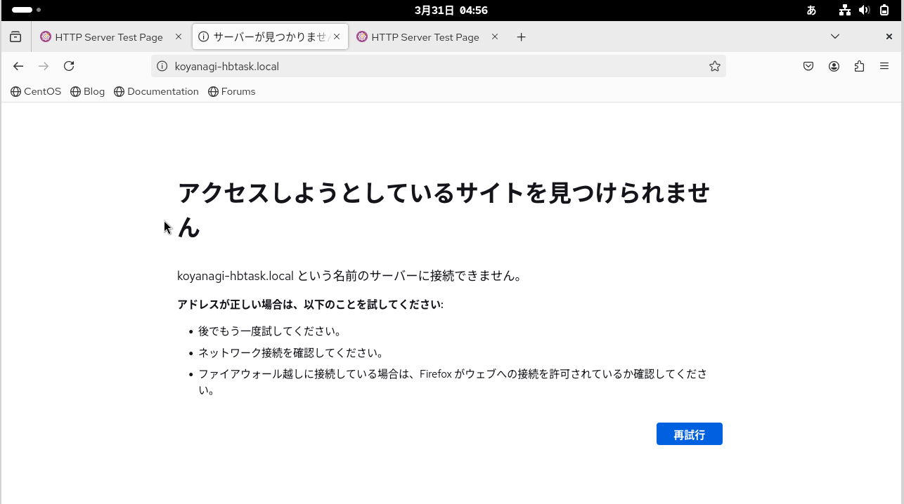
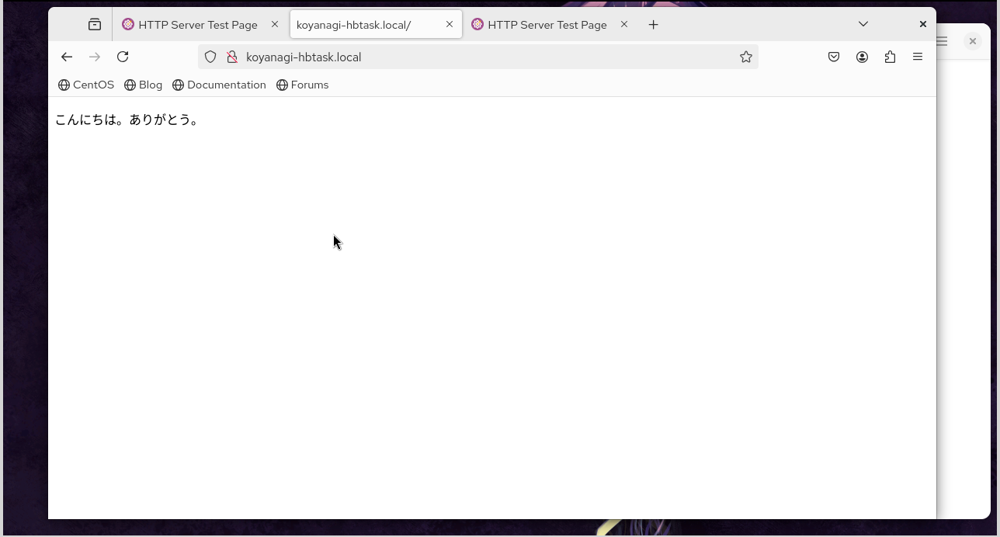
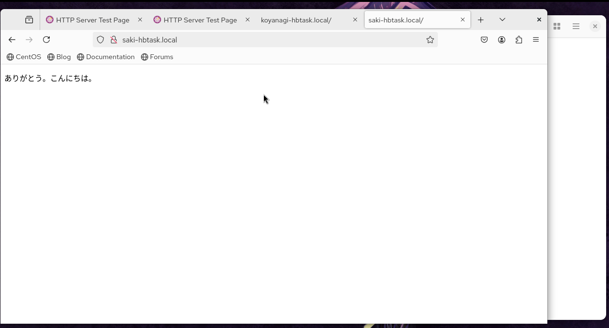

# 🔴課題4 Apache

LAMPのAであるApacheをインストールし、Webページが表示される環境を作りましょう

## 🔵要求仕様

- Apacheのバージョンは2.4系をインストールしてください
- Apacheは自動起動するように設定してください
- サーバが再起動しても自動でApacheが起動する<br>
🟩ヒント
- `man systemctl`<br>
<br>

- VirtualHostの機能を利用し、下記の要件を満たしてください
- Webブラウザで`http://<自分の名字>-hbtask.local/` にアクセスすると「こんにちは。ありがとう。」と表示される
- 例: `http://kuramochi-hbtask.local`
- Webブラウザで`http://<自分の名前>-hbtask.local/` にアクセスすると「ありがとう。こんにちは。」と表示される
- 例: `http://wataru-hbtask.local/`<br>
🟩ヒント
- hostsファイルを利用して名前解決を行います
<br>
<br>

## 🔵 注意点

- パッケージインストールの手順は公式ドキュメントに記載がないため、下記コマンドでインストールしてください(自分のOSに合ったコマンドを実行してください)
- `yum install httpd`
- `dnf install httpd`
- `apt install apache2`
- Apacheの設定方法は公式ドキュメントを参考にしましょう
- hostsファイルについては一次情報源を見つけることは困難なので、他のサイトを参考にしてOKです
<br>
<br>

## まとめ

### 🟡Appachをインストール

- Apacheとは、世界中で広く使われているオープンソースのWebサーバソフトウェア。<br>

- Webサーバとは
インターネット上でWebページを提供するためのコンピュータやソフトウェアのことを指す。<br>
例えば、Webブラウザ（Google ChromeやSafariなど）を使ってWebサイトにアクセスすると、その要求はWebサーバに送られる。<br>
Webサーバは、その要求を受け取り、対応するWebページの情報（テキストや画像など）をWebブラウザに送り返す。<br>
Webブラウザはその情報を解釈し、ユーザーが見ることができるWebページとして表示する。
<br>
<br>

#### 🟩Apacheをインストール

今回のゴール<br>
- Apacheのバージョンは2.4系をインストール
- Apacheは自動起動するように設定してください
- サーバが再起動しても自動でApacheが起動する<br>

[参考サイト:LinuxサーバにApacheをインストールしてみた](https://blog.jbs.co.jp/entry/2024/01/31/091808)
<br>
<br>
🟢手順<br>

#yum で指定されたhttpdパッケージに関する情報を表示。<br>
これには、パッケージ名、バージョン、リリース、サイズ、インストール日時、依存関係などが含まれる場合がある。httpdは、Apache HTTP Serverパッケージの名前。<br>
```
$ yum info httpd
```
✅バージョン：2.4.63　と表示された。2.4系をインストール⭕️
<br>

#apacheをインストール
```
$ yum -y install httpd
```

#apacheのバージョン確認
```
$ httpd -version
```


<br>
<br>

### 🟡Apacheを自動起動するように設定／サーバが再起動しても自動でApacheが起動する

[参考サイト:【CentOS】Apacheを起動/停止/再起動/自動起動する方法](https://coeure.co.jp/blog/infrastructure/centos/centos-apache-210206)
<br>

#現在の設定がどうなっているかを確認
```
$ systemctl is-enabled httpd
```
→結果：disabled と出力
<br>
「disabled」と表示される場合は、自動起動の設定がされていない。
次のコマンドで自動起動の設定をする。

#自動起動の設定
```
$ systemctl enable httpd.service
```
<br>

#正しく設定されたか確認
```
$ systemctl is-enabled httpd
```

→結果：enabled　と出力

<br>
<br>

#### 🟩サーバが再起動しても自動でApacheが起動するか確認

#サーバーを再起動
```
$ reboot
```

#再起動後でもApacheが動いているか確認
```
$ systemctl status httpd
```
→結果：active(running)と表示あり。

<br>
<br>

#### 🟩自分のIPアドレスを調べる

#自分のIPアドレスを調べる
```
$ ifconfig
```
→結果：inet 10.0.2.15　と　127.0.0.1<br>
※Macはinetと書かれた行の最大3桁数字が4つ並んでいますので、それがあなたのパソコンのローカルIPアドレス。
<br>

※ifconfig コマンドを使用すると、システムの特定のインタフェースに割り当てられているすべてのアドレスを表示できる。
<br>

⚪︎10.0.2.15
- enp0s3という名前のインターフェイスのIPアドレス。

⚪︎127.0.0.1
- lo<br>
ループバック（Loopback）インターフェースを表す。
このインターフェースは、同じコンピュータ内でネットワーク通信を模擬するために使用される。
<br>
<br>

### 🟡Apache起動後、テストページを開く

#### 🟡firewalldのport tcp/80を解放

※⚠️ローカルマシンで`http://10.0.2.15`　と、`http://127.0.0.1`　にアクセスしてみるが、アクセスができないとエラーページが表示される。
<br>

[参考サイト:3. "Firewallを設定する"の、「firewalldの443ポートを開ける」](https://qiita.com/yamada-hakase/items/9121be88c94f79e6cc65)
<br>
これを参考に、設定していたfirewalldのportが解放されていないことが原因？と考えた。
<br>

#firewalldのport tcp/80を解放
```
$ firewall-cmd --add-port=443/tcp  --permanent --zone=public
```
→”success”と表示
<br>

#リロードして設定を有効化
```
$ firewall-cmd --reload
```
→”success”と表示

<br>
<br>
firewallにport80/tcp　が解放されたことを確認。<br>

ここで再度ローカルマシンで、`http://10.0.2.15`　と、`http://127.0.0.1`　にアクセスしてみるが、アクセスができないと同様のエラーページが表示される。
<br>

※⚠️ここで仮想サーバーを調べたところ、「もしかしてローカルマシンじゃなくて仮想サーバー内にブラウザがあるのか？」と気づく<br>
→仮想サーバー内でアクセスしたところテストページが開いた。⭕️
<br>
<br>
①仮想サーバー”ソフトウェア”→”FireFox”でブラウザにアクセス<br>

②`http://10.0.2.15`、`http://127.0.0.1` にアクセスすると、Apacheのテストページが表示される。
<br>
<br>

- `http://10.0.2.15`


<br>

- `http://127.0.0.1'`

<br>
<br>

### 🟡VirtualHostの機能を利用し、webブラウザで下記URLでアクセス可能にする
<br>

- ①Webブラウザで`http://<自分の名字>-hbtask.local/` にアクセスすると「こんにちは。ありがとう。」と表示される<br>
例: `http://kuramochi-hbtask.local`

<br>

- ②Webブラウザで`http://<自分の名前>-hbtask.local/` にアクセスすると「ありがとう。こんにちは。」と表示される<br>
例: `http://wataru-hbtask.local/`

<br>

🟩VirtualHostとは<br>
1 台のマシン上で (company1.com と company2.com のような) 二つ以上のウェブサイトを扱う運用方法のことを指す。
<br>
<br>

#### 🟡バーチャルホスト用の設定ファイル作成

- [参考サイト:VirtualHostでドメインを２つ以上作る](https://masaki-blog.net/apache-virtualhost)
<br>

✅/etc/httpd/conf/conf.d内を下記のように編集
<br>
```
<VirtualHost *:80>
    DocumentRoot /usr/local/apache2/htdocs/
</VirtualHost>

<Directory "/var/www/">
    Require all granted
</Directory>

<VirtualHost *:80>
    DocumentRoot /var/www/koyanagi-hbtask.local/
    ServerName koyanagi-hbtask.local
</VirtualHost>

<VirtualHost *:80>
    DocumentRoot saki-hbtask.local/
    ServerName saki-hbtask.local
</VirtualHost>
```
<br>
<br>

🟩/var/www/配下に”koyanagi-hbtask.local”フォルダを作成し、その中のindex.htmlに下記を記述。
<br>

- [参考サイト:HTMLの書き方](https://diveintocode.jp/blogs/Technology/depHtmlIntroduction#blog_3)
<br>

```
<!DOCTYPE html>
<html>
<body>
<p> こんにちは。ありがとう。 </p>
</body>
</html>
```
<br>
<br>
⚠️※仮想サーバー内で日本語を入力<br>

最初日本語の入力ができなかったので、
[参考サイト:Linuxで日本語入力できない場合の対処方法](https://www.cite.ehime-u.ac.jp/wp-content/uploads/docs/linux_japanese_input.pdf)　のサイトを参考に試してみた。<br>

“mozc”がなかったのでインストールしようと試みるも、引数に一致するものが見当たらないとのエラーが出てインストールはできなかった。<br>
#ibus-mozc(日本語の入力環境としてよく用いられる)
```
$ sudo def install -y bus-mozc mozc-utils-gui
```
<br>

→ので、やり方だけ参考サイトを参考にし、<br>
仮想サーバー起動→設定→キーボード→入力ソース のAdd Input Source に”日本語（Anthy）”を追加。<br>
→下にあるキーボードショートカットの”タイピング”を選択。<br>
「次の入力ソースへ切り替える」を選択し、macの”かな”ボタンを選択。日本語入力ができるようになった。
<br>

この状態で、仮想サーバーのブラウザにて、`http://koyanagi-hbtask.local`　にアクセス。<br>
下記のような画面が表示された（アクセスできなかった）。

<br>
<br>

### 🟡/etc/hostsの設定

[参考サイト:ApacheのVirtualHostと/etc/hostsの関係](https://blog.trippyboy.com/2011/apache/apacheのvirtualhostとetchostsの関係/)

#✅仮想サーバーの/etc/hostsに、”127.0.0.1 koyanagi-hbtask.local”と追記
```
$ sudo vim /etc/hosts
```
<br>

再度　`http://koyanagi-hbtask.local`　にアクセスしたところアクセス成功した。


<br>
<br>
ということで、上記の要領で下記もやっていく。<br>

Webブラウザで`http://<自分の名前>-hbtask.local/` にアクセスすると「ありがとう。こんにちは。」と表示される
- 例: `http://wataru-hbtask.local/`
<br>

上記のように行ったが、`http://saki-hbtask.local`　で、なぜかテストページが開く。<br>
先ほどの参考サイトを見てみると、最後に”Apacheの起動”とあるので、再起動してみた。

#httpd(Apache)を再起動
```
$ sudo systemctl restart httpd
```

再度`http://saki-hbtask.local`　にアクセスしたら無事に画面が表示された。

<br>
<br>

## 🔵次回試してみたいこと

・今回はApacheをインストールして行ったが、Apacheとよく比較として出てくるNginxでも同様の環境構築をして、違いを確認してみたい。

・仮想サーバー内のブラウザにてアクセスして画面を表示していたので、ローカル環境でアクセスして画面が表示されるかを試したい。

・今回はHTTPでWebサイトにアクセスをしていたので、HTTPS化をしてみたい。
