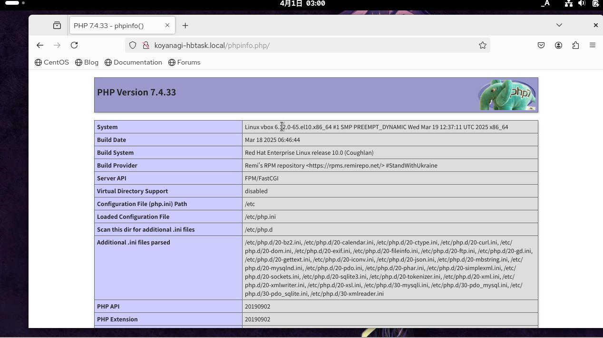

# 🔴課題5 PHP

LAMPのPであるPHPをインストールし、PHPを利用したWebページが表示される環境を作りましょう

## 🔵要求仕様

- PHPのバージョンは7系をインストールしてください
- Webブラウザで`http://<自分の名字>-hbtask.local/phpinfo.php`にアクセスすると、phpinfoの情報が表示される


## 🔵 注意点

- パッケージインストールの手順は公式ドキュメントに記載がないため、自分のOSに合ったインストール方法を他のサイトを参考にしてOKです<br>

- デフォルトで登録されているリポジトリでPHPの7系がインストールできない場合は、サードパーティのリポジトリを利用してインストールしてください

## まとめ

### 🟡PHPをインストール
[参考サイト:PHPをインストール](https://www.miraiserver.ne.jp/column/about_php-install-method/#PHP)　を参考
<br>

#パッケージリストを更新
```
$ sudo yum update
$ sudo yum upgrade
```
<br>

⚠️今回はPHPのバージョンは７系をインストール！<br>

#バージョン7.3をインストール
```
$ sudo yum install —disablerepo=* --enablerepo=epel,remi,remi-safe,remi-php73 php
```
→結果：　エラー：不明なrepo : ‘remi’　　と表示される

[PHP公式サイト](https://www.php.net/manual/ja/install.unix.dnf.php) を参考
<br>

#パッケージをインストールする前に、パッケージリストが最新であることを確認
```
$ dnf install php php-common
```
<br>

#変更を有効化するために、以下のようなコマンドでサーバーの再起動
```
$ sudo systemctl restart httpd
```
<br>

#PHPをインストール
```
$ sudo dnf install php-mysqlnd php-gd
```
<br>

#“EPEL”と”Remi”リポジトリをインストール
```
$ yum -y install epel-release 
$ yum -y install http://rpms.famillecollet.com/enterprise/remi-release-7.rpm
```
<br>

#システムのパッケージを最新の状態に更新
```
$ sudo dnf update -y
$ sudo reboot
```


#EPELおよびRemiリポジトリの追加：PHP 7.4はデフォルトのリポジトリには含まれていないため、EPELおよびRemiリポジトリを追加する<br>

[参考サイト：dnfでphpのバージョンを指定してモジュールでインストールする方法](https://tech.torico-corp.com/blog/dnfでphpのバージョンを指定してモジュールでインストールする方法/)<br>
dnfでphpのバージョンを指定してモジュールでインストールする方法
<br>

今回の仮想サーバーの環境がcentOS Stream 10のため、”epel-release-latest-10”にしてコマンドを入力。<br>
→❗️つまり適切なEPELとRemiリポジトリの追加
<br>
<br>

- EPELリポジトリとは<br>
EPELリポジトリ（Extra Packages for Enterprise Linux）。<br>
Red Hat Enterprise Linux（RHEL）やその互換ディストリビューション向けのソフトウェアを集積したリポジトリである。<br>
ディストリビューションのリポジトリに含まれていないもので、よく使われるパッケージが多く含まれている <br>
<br>

- Remiリポジトリ
最新のPHPスタックが使え、その他のソフトウェアを、できる限りそのままのバージョンのまま利用できるようにしている。<br>
remiには常に最新のミドルウェアのパッケージがアップされ、古いバージョンは削除されていく。<br>
<br>

✅EPELのように、ディストリビューション本家以外が提供するリポジトリを「サードパーティー・リポジトリ」と呼ぶ。<br>
✅Remiもサードパーティリポジトリの1つで、PHPやMySQLなどの最新パッケージに強いのが特徴。 
<br>
<br>
#EPELリポジトリ、Remiリポジトリを追加
```
$ sudo dnf install -y https://dl.fedoraproject.org/pub/epel/epel-release-latest-10.noarch.rpm

$ sudo dnf install -y https://rpms.remirepo.net/enterprise/remi-release-10.rpm
```
<br>
<br>

[参考サイト:モジュールのリストを確認し、インストール](https://qiita.com/taconana/items/0468133fedd0e0deff38?utm_source=chatgpt.com)

#モジュールとパッケージのリストを表示
```
$ dnf module list php
```
→✅php 7系はremi-7.4のみリストに表示されている状態を確認。<br>
<br>

#PHP7.4をインストール
```
$ yum install php74
```
→インストール完了後、PHPのバージョンを確認
```
$ php -v
```
→実行しても、”bash: /usr/bin/php: そのようなファイルやディレクトリはありません”と表示された。
<br>

[参考サイト:CentOS Stream 8 にPHP7.4をDNFでインストール](https://aulta.co.jp/technical/server-build/centos-stream-8/php/dnf-install-php-7-4?utm_source=chatgpt.com)　を参考にPHP７系をインストール　
<br>

#php:remi-7.4をインストール
```
$ dnf module install php:remi-7.4
```
→インストール完了後、PHPのバージョンを確認
```
$ php -v
```
→🎉PHP 7.4.33 と表示された！
<br>
<br>

🗣️余談（必要になったときに再確認）<br>

#PHPモジュールの有効化：RemiリポジトリからPHP 7.4をインストールするために、PHPモジュールを有効化する
```
$ sudo dnf module reset php -y
$ sudo dnf module enable php:remi-7.4 -y
```
<br>
<br>

### 🟡phpinfo.phpにアクセスして、phpの情報が表示されるようにする

[参考サイト:phpinfoに関して](https://www.sejuku.net/blog/49565#index_id0)
<br>

#var/www/koyanagi-hbtask.local/配下に、”phpinfo.php”ファイルを作成
```
$ cd var/www/koyanagi-hbtask.local
$ sudo vim phpinfo.php
```
<br>

#作成したphpinfo.phpファイルの中身を下記のように追記
```

<?php
phpinfo();
?>

```
:wqで保存
<br>

※必要に応じてApacheを再起動
```
$ reboot
```
<br>

✅仮想サーバーのブラウザにて、`http://koyanagi-hbtask.local/phpinfo.php`　にアクセス


<br>
<br>

 ## 🔵次回試してみたいこと

・PHP 7.4ではなく最新版（例：PHP 8.3）をインストールした場合、今回と同じことを行ったら何が変わるのか、何がアップデートされているのかを試してみたい

　　- phpinfoの内容が変わるのか？変わった部分は何が以前と異なるのか確認してみたい。


