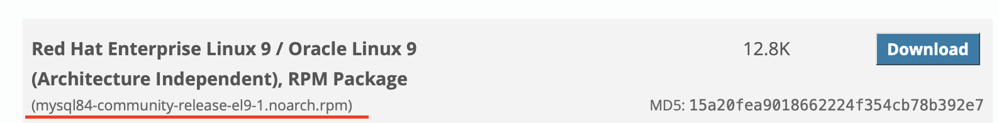
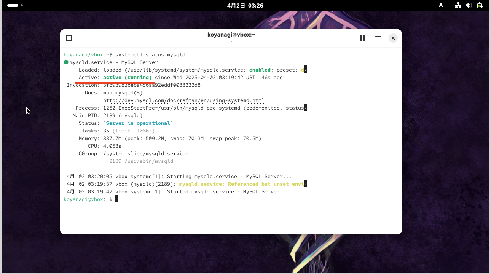
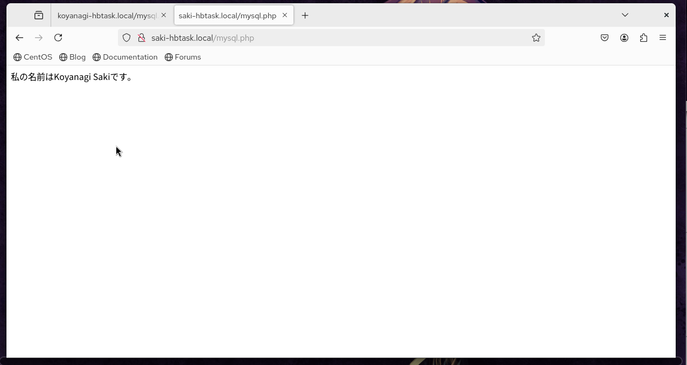

# 🔴課題6 MySQL

LAMPのMであるMySQLをインストールし、データベースを利用したPHPのWebページが表示される環境を作りましょう

## 🔵要求仕様

- MySQLのバージョンは8系をインストールしてください
- MySQLは自動起動するようにしてください
- MySQLに新しく`hbtask`というデータベースを作成してください
- `hbtask`データベースに`meibo`というテーブルを作成してください
<br>

🟩 カラム
- `number`（INT）
- `username`（VARCHAR）
- `meibo`テーブルに下記データを登録してください
- `number`: 1
- `username`: <自分のフルネーム>
- 例: `Kuramochi Wataru`
- Webブラウザで`http://<自分の名前>-hbtask.local/mysql.php`にアクセスすると、`meibo`テーブルに登録した自分のフルネームが表示される
- `meibo`テーブルから、`number`カラムが1の`username`を抽出させる
- 表示例: 「私の名前は Kuramochi Wataru です。」
<br>


## 🔵 注意点

- MySQLの公式ドキュメントを参考に、インストールと設定を行いましょう

## まとめ

### 🟡MySQLのインストール

[参考サイト：MySQL公式サイト 2.5.1 MySQL Yumリポジトリを使用したLinuxへのMySQLのインストール](https://dev.mysql.com/doc/refman/8.4/en/linux-installation-yum-repo.html)
<br>

#### 🟢MySQL Yumリポジトリの追加

✅今回は、バージョン8.4をインストール
下記をダウンロード
赤線部分は、ダウンロード後にインストールする際に使用

<br>

#システム用にダウンロードしたRPMをインストール<br>
⚠️※この時、上の画像の赤線部分を参考にplatformとversion-numberを入力<br>
```
$ sudo yum localinstall mysql84-community-release-{platform}-{version-number}.noarch.rpm
```

→結果、下記の文言が出力。<br>
"`Can not load RPM file: mysql84-community-release-el9-1.noarch.rpm <br>
開くことができませんでした：mysql84-community-release-el9-1.noarch.rpm`"
<br>

#MySQL Yumリポジトリが正常に追加および有効になっていることを確認<br>
```
$ yum(またはdef) repolist enabled | grep mysql.*-community
```
→結果：下記のように表示された。

- mysql-8.4-lts-community MySQL 8.4 LTS Community Server 
- mysql-connectors-community MySQL Connectors Community 
- mysql-tools-8.4-lts-community Mysql Tools 8.4 LTS Community
<br>
<br>

#### 🟢リリースシリーズの選択

💡「MySQL Yumリポジトリを使用する場合、最新のバグ修正シリーズ（現在はMySQL 8.4）がデフォルトでインストールに選択されます。<br>
これがあなたが望むものなら、次のステップであるMySQLのインストールにスキップできます。」<br>
とのこと。8.4のバージョンでいいので、MySQLのインストールまでスキップ。
<br>
<br>

#### 🟢MySQLのインストール

#mysqlをインストール
```
$ sudo yum install mysql-community-server
```
→これにより、<br>
①MySQLサーバーのパッケージ（mysql-community-server）<br>
②クライアントのパッケージ（mysql-community-client）<br>
③クライアントとサーバーの一般的なエラーメッセージと文字セット（mysql-community-common）<br>
④共有クライアントライブラリ（mysql-community-libs）<br>
など、サーバーの実行に必要なコンポーネントのパッケージもインストールされる。
<br>

#バージョンの確認
```
$ mysql —version
```
→結果：mysql Ver 8.4.4 for Linux on x86_64(MySQL Community Server - GPL)　と表示された！
<br>
<br>

### 🟡MySQLを自動起動するように設定

⚠️オペレーティングシステムがsystemdが有効になっている場合、stop、start、status、restartなどの標準systemctl（または引数を逆にしたservice）コマンドを使用して、MySQLサーバーサービスを管理する必要があります。<br>
mysqldサービスはデフォルトで有効になっており、システムの再起動時に開始されます。詳細については、セクション2.5.9「systemdによるMySQLサーバーの管理」を参照してください。<br>
とのこと。なのでアクセスしてみた。
<br>

→[参考サイト：セクション2.5.9「systemdによるMySQLサーバーの管理」](https://dev.mysql.com/doc/refman/8.4/en/using-systemd.html)
<br>

- systemd の概要
「systemd は、MySQL サーバーの自動起動および停止を提供します。 また、systemctl コマンドを使用した手動サーバー管理も有効になります」<br>

とのことより、一度仮想サーバーを削除し再起動した。
<br>

#mysqlが稼働しているかどうかを確認
```
$ systemctl status mysqld
```
→結果：active(runnnig)になっていることを確認！

<br>
<br>

サーバーの初期起動時に、サーバーのデータディレクトリが空であることを考えると、次のことが起こる。

- サーバーが初期化される。
- SSL証明書とキーファイルはデータディレクトリで生成される。
- validate_passwordがインストールされ、有効になっている。
- スーパーユーザーアカウント'root'@'localhostが作成される。
<br>

#スーパーユーザーのパスワードが設定され、エラーログファイルに保存される。表示するには、次のコマンドを使用。
```
$ sudo grep 'temporary password' /var/log/mysqld.log
```
→結果：`2025-04-01T17:33:32.454937Z 6 [NOTE] [MY-010454] [Server] A temporary password is generated for root@localhost: E,Tg7reJj#-=`<br>
と出力
<br>

#生成された一時パスワードでログイン
```
$ mysql -uroot -p
```

#スーパーユーザーアカウントのカスタムパスワードを設定して、ルートパスワードを変更
```
mysql> ALTER USER 'root'@'localhost' IDENTIFIED BY ‘自分で設定する新しいパスワード’;
```
→結果：”Query OK”と出力された！
<br>
<br>

### 🟡MySQLに新しく`hbtask`というデータベースを作成

[参考サイト:MySQL公式サイト「データベースの作成と選択」](https://dev.mysql.com/doc/refman/8.4/en/creating-database.html)
<br>

#mysqlにログイン
```
$ mysql -uroot -p
```

#hbtaskデータベースを作成
```
mysql> $ CREATE DATABASE hbtask;
```

#hbtaskデータベースに移動
```
mysql> $ USE hbtask;
```

#今いるデータベースのテーブルを確認
```
mysql> $ SHOW DATABASE;
```
→結果：Empty set(0.01 sec)と表示。空であることを確認。
<br>
<br>

### 🟡"meibo"というテーブルを作成

#meiboテーブルを作成し、”number INT” と、 ”username VARCHAR”をカラムとして追加<br>
⚠️VAARCHARは必ず文字数の上限を決める必要があり！なので今回は２０文字と設定。<br>
```
mysql> $ CREATE TABLE meibo(number INT, username VARCHAR(20));
```
→結果："Query OK"　と出力

#number→１、VARCHAR→Koyanagi Saki　のデータをを直接カラムに入れる
```
mysql> $ INSERT INTO meibo (number, username) VALUES (1, ‘Koyanagi Saki’);
```

#meiboテーブルにそれぞれのカラムの情報が入っているか確認<br>
⚠️「*」＝「全て」。meiboテーブル全てのカラムを見たい時に使う。
```
mysql> $ SELECT * FROM meibo
```
→結果："number: 1　VARCHAR: Koyanagi Saki"　と表示された！
<br>
<br>

### 🟡Webブラウザで`http://<自分の名前>-hbtask.local/mysql.php`にアクセスすると、`meibo`テーブルに登録した自分のフルネームが表示される

下記参考サイト
- [PHPでMySQL(データベース)の情報をWebページに表示させたい](https://qiita.com/usayamadausako/items/dbf31c1890115931f506?utm_source=chatgpt.com)

- [PHPとMySQLの接続方法をわかりやすく解説【初心者向け】](https://qiita.com/juki1009/items/317f0ec93fe86f23320a?utm_source=chatgpt.com)

- [phpでPDOを用いた、データ取得など](https://qiita.com/dossy/items/98dab6b44a38d91b2b70?utm_source=chatgpt.com)

- [MySQLでよく使うコマンド一覧とオプションまとめ](https://proengineer.internous.co.jp/content/columnfeature/6985#section315)

<br>

`var/www/saki-hbtask.local/mysql.php`内に以下を記述
```
<?php 
  // データベースへの接続 
  $pdo = new PDO("mysql:host=127.0.0.1;dbname=hbtask;charset=utf8", "root", “MySQLのパスワード”); 

  // SQLクエリの準備と実行 
  $sql = "SELECT username FROM meibo WHERE number = 1"; 
  $stmt = $pdo->prepare($sql); 
  $stmt->execute(); 

  // 結果の取得 
  $row = $stmt->fetch(PDO::FETCH_ASSOC); 

  // 結果が存在する場合の処理 
  if ($row) { 
      echo "私の名前は " . $row['username'] . " です。"; 
  } 
?>
```

- `PDO`とは<br>
PDO（PHP Data Objects）は、PHPでデータベースにアクセスするためのオブジェクト指向の拡張ライブラリ。<br>
PDOを使用すると、さまざまな種類のデータベース（MySQL、PostgreSQL、SQLiteなど）に対して統一された方法でアクセスすることができる。
<br>

- `prepare`とは<br>
prepare = SQL文の基本部分が同じで値だけ異なるような場合(例えば同じテーブルに値だけ変えて何回もデータを挿入するような場合)に効率よく行える機能を提供。<br>
<br>
似たものに`query`がある<br>
query：変動値がない場合に使用
```
$pdo->query('SELECT * FROM user');
```

prepare：変動値がある場合に使用(prepare、bindValue、executeを使う)<br>
```
// SQL文の実行準備
$stmt = $pdo->prepare("SELECT * FROM user WHERE name=:name");

// 変数の値をバインド
$stmt->bindValue(':name', $name, PDO::PARAM_STR);

// SQL実行
$stmt->execute();
```

- execute()とは<br>
execute関数 = PHPの標準関数でプリペアドステートメントを実行する際に使われる関数。<br>
プリペアドステートメントは、SQL文で値が変わる可能性がある箇所に対して、変数のように別の文字列を入れておき、後で置き換える仕組み。<br>
SQLインジェクションの対策としても使われてる。<br>

execute関数を使う前にPDOオブジェクトを作成してデータベースへの接続、プリペアドステートメントのSQLをprepare関数を使って設定しておく。<br>
設定できた上でexecute関数を使うことでSQL文を実行可能。

- `PDO::FETCH_ASSOC`とは<br>
結果セットに返された際のカラム名で添字を付けた配列を返す。
<br>

`http://<自分の名前>-hbtask.local/mysql.php`でアクセスしたところ下記のように表示された。

<br>
<br>

## 🔵次回試してみたいこと

・今回は、meiboテーブルに対してMySQLのコマンドラインからINSERT文を使って直接データを1件追加する方法を試したので、
CSVやTSVなどのファイルのデータをMySQLに追加する方法を試してみたい。
