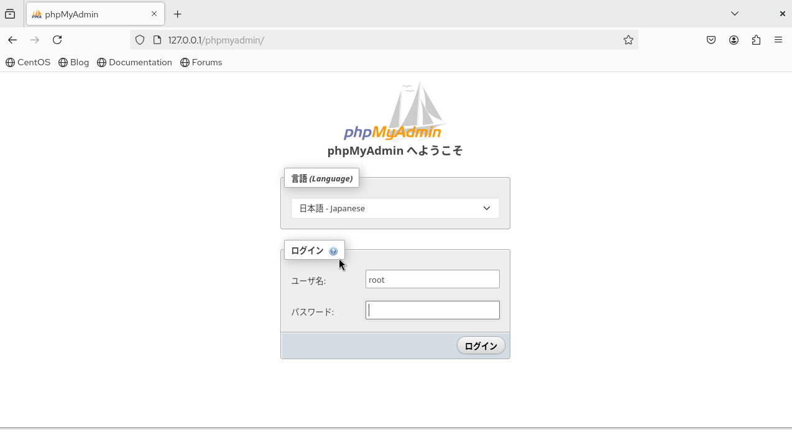
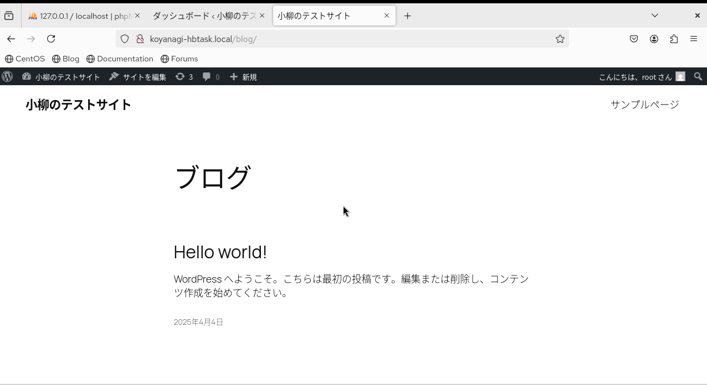
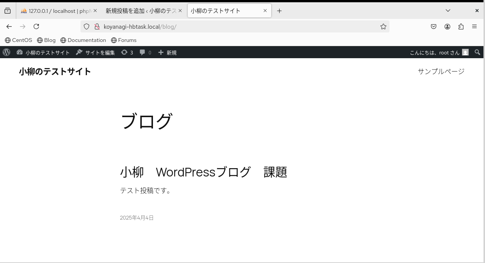

# 🔴課題7 WordPress

WordPressを利用してブログサイトを構築しましょう

## 🔵要求仕様

- Webブラウザで`http://<自分の名字>-hbtask.local/blog/`にアクセスすると、WordPressのブログサイトが表示される
- 構築したブログサイトで記事の投稿ができる

## 🔵 注意点

- パッケージのインストールではなく、公式サイトの手順を参考にインストールしてください

## まとめ

- Wordpressとは
ブログやホームページを作成できる無料のCMS（コンテンツマネジメントシステム）。<br>

  - HTMLやCSSなどの専門知識がなくても、高品質なWebサイトを作成できる。　　
  - テーマやプラグインでデザインや機能をカスタマイズできる。
  - SEOに優れており、検索エンジンによるインデックスが容易である。
  - ユーザー管理機能が充実しており、複数人での編集が可能。
<br>
　
### 🟡WordPressをダウンロード

[WordPress を入手](https://ja.wordpress.org/download/)　より、WordPressをダウンロード
<br>

ダウンロード後は、[ダウンロード以降の参考サイト](https://developer.wordpress.org/advanced-administration/before-install/howto-install/) を参考にしていく。
<br>

[phpMyadminをインストール](https://www.kagoya.jp/howto/it-glossary/develop/phpmyadmin/)<br>


#phpMyAdminをインストール
```
$ sudo yum install phpmyadmin
```
<br>

インストール後、再度「`http://127.0.0.1/phpmyadmin`」にアクセス<br>
→「403 Forbidden」とエラーが出た。<br>
<br>
#インストールしたphpmyadminを反映されてないかもなので念の為Apacheを再起動<br>
[参考サイト](https://www.sakura-vps.net/centos7-setting-list/phpmyadmin-settings-for-sakura-vps-centos7/)
```
$ sudo systemctl restart httpd
```
→結果：再度「`http://127.0.0.1/phpmyadmin`」にアクセスしたら繋がった！

<br>

### 🟡phpMyadmin

- phpMyadminとは<br>

  - MySQLやMariaDBなどのデータベースをWebブラウザ上で管理できるツール。
  - データベースの作成や管理、バックアップ、テーブルの操作、SQLクエリの実行などが可能。
  - PHPで書かれており、直感的にデータベースを操作できるよう設計されている。


[参考サイト:phpMyAdminのログイン確認](https://dw.alpha-prm.jp/support/tool/php/v2/step_05.html)<br>
アクセスしたら、最初にログイン画面になるので、mysqlのユーザー名／パスワードを入力してログイン

<br>
<br>

#### 🟩Wordpress専用のMySQLデータベース作成・ユーザーを確認

[公式サイト：ステップ2を参照](https://developer.wordpress.org/advanced-administration/before-install/howto-install/)

- データベース名：wordpress　　　utf8mb4_general_ci　　を選択

- ユーザー：今回は”root”　を使用
  - ユーザ名：root 
  - ホスト名：localhost 
  - パスワード：はい 
  - グローバル権限：ALL PRIVILEGES 
  - 権限委譲：はい

  <br>
  <br>

### 🟡wp-config.phpを設定

[公式サイト：ステップ3を参照](https://developer.wordpress.org/advanced-administration/before-install/howto-install/)

- wp-config.phpとは
WordPress（ワードプレス）の動作に関する設定が記述されたファイル。<br>
WordPressのデータベース接続情報やセキュリティ設定、言語設定などが含まれている。 
<br>

#wordpress内のファイル ”wp-config-sample.php”を”wp-config.php”に変更
```
$ mv wp-config-sample.php wp-config.php
```

#テキストエディターでフォルダマークを選び、ダウンロードからwp-config.phpを選択し反映

`wordpress > wp-config.php`
<br>

#wp-config.php内に、「`// ** MySQL settings - You can get this info from your web host ** //`」の部分があるので、そこに下記のように記述

```
🟦設定

・’DB_NAME’：’wordpress’
ステップ2でWordPress用に作成したデータベースの名前。

・’DB_USER’：’root’
ステップ2でWordPress用に作成したユーザー名。

・’DB_PASSWORD’：’WordPressのユーザー名に選択したパスワードを入力’
ステップ2でWordPressのユーザー名に選択したパスワード。

・’DB_HOST’：’localhost’
ステップ2で決定したホスト名（通常はlocalhostですが、必ずしもそうではありません。DB_HOSTの値が考えられるようです）。
ポート、ソケット、またはパイプが必要な場合は、コロン（:）を追加してから、関連する情報をホスト名に追加します。


※
・DB_CHARSET：データベースの文字セットは、通常、変更しないでください（wp-config.phpの編集を参照してください）。
・DB_コレート：データベースの照合は通常空白のままにしておく必要があります（wp-config.phpの編集を参照してください）。
```
<br>
<br>

### 🟡ファイルをアップロード

[公式サイト：ステップ4を参照](https://developer.wordpress.org/advanced-administration/before-install/howto-install/)
<br>

「WordPress を活用したサイトをドメインのどこに表示するかを決定する必要がある。<br>
今回表示したいのは、`http://koyanagi-hbtask.local/blog/`にアクセスした時に開いて欲しいので、「– あなたのウェブサイトのサブディレクトリに。（例：`https://example.com/blog/`」にを参考。下記を参照。<br>

サブディレクトリで
・Webサーバーにファイルをアップロードする必要がある場合は、ワードプレスディレクトリの名前を希望の名前に変更し、FTPクライアントを使用して、ウェブサイトのルートディレクトリ内の希望の場所にディレクトリをアップロードします。」<br>
とのこと。


✅今回はサブディレクトリで
・ファイルがすでにWebサーバーにあり、シェルアクセスを使用してWordPressをインストールしている場合は、WordPressディレクトリをWebサイトのルートディレクトリ内の希望の場所に移動し、ディレクトリの名前を希望の名前に変更します。<br>


#koyanagi-hbtask.local/配下にblogフォルダを作成
```
$ sudo mkdir blog
```

#`~/ダウンロード/wordpress-6.7.2-ja/wordpress/`配下のファイルを、
`/var/www/koyanagi-hbtask.local/blog/`に移動
```
$ sudo mv ~/ダウンロード/wordpress-6.7.2-ja/wordpress/* /var/www/koyanagi-hbtask.local/blog/
```
<br>
<br>

### 🟡インストールスクリプトを実行する
[公式サイト：ステップ5を参照](https://developer.wordpress.org/advanced-administration/before-install/howto-install/)<br>


Web ブラウザをポイントして、インストール スクリプトを起動<br>
たとえば、blogというサブディレクトリにWordPressファイルを配置した場合は、<br>
`https://example.com/blog/wp-admin/install.php`にアクセスしてください。

とのことなので、下記のURLにアクセスした。
`http://koyanagi-hbtask.local/blog/wp-admin/install.php`

# Wordpressのセットアップ
[参考サイト:誰でも出来るWordPressのインストール手順！から"インストールスクリプトを実行する"以降](https://majimoney.com/install-wordpress/#index_id7)

- サイトのタイトル：小柳のテストサイト
- ユーザー名：WordPressのユーザー名
- パスワード：WordPressのパスワード
- メールアドレス：WordPress登録の際に登録したメールアドレス
- 検索エンジンでの表示：”検索エンジンがサイトをインデックスしないようにする”　に✅入れた<br>

インストール実行→ログイン→ダッシュボード開けた<br>


🟩`http://koyanagi-hbtask.local/blog/`にアクセス

上記にアクセスしたら、サイトが表示された！

<br>
<br>

### 🟡構築したブログサイトで記事の投稿ができる
[参考サイト:WordPress記事の書き方〜投稿方法を7STEPで解説！](https://www.xfree.ne.jp/media/wp-post/#STEP1_記事作成画面を開く)
<br>

Wordpressのダッシュボード<br>
＞左側ダッシュボードの「投稿」<br>
＞”投稿一覧”の中の「新規投稿を追加」<br>
＞記事を作成<br>
<br>

作成した記事を投稿後に、`http://koyanagi-hbtask.local/blog/`　にアクセスしたら下記のように投稿されていた。

<br>
<br>

## 🔵次回試してみたいこと

・WordPress以外のPHPで作られたWebアプリやHTMLのサイトにもアクセスできるのか試してみたい。

・今回はphpMyadminを利用してWordPress用のデータベースを作成したが、phpMyadminを使わずにCLIでの操作だけで行えるか試してみたい。


